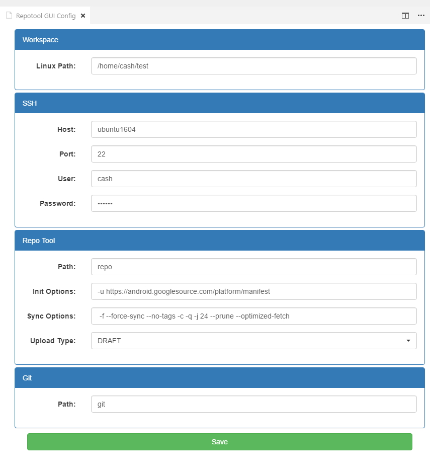

# Repotool GUI

Repogui is an auxilary GUI for repotool. 

Open VSCode with AOSP full codebases or partial projects to use the extension.

## Features

### Configuration

* Windows

> 

* Linux

> No need to do extra settings

### Repo info

### Repo status

Partial & Full project refresh

### Repo upload

### Repo sync

## Known Issues

welcome to report

## Release Notes

### 0.1.2

fix the release defect

### 0.1.1

status ui refinement

### 0.1.0

Support repo info, repo status, repo upload, repo start, repo sync

### 0.0.1

Initiate
